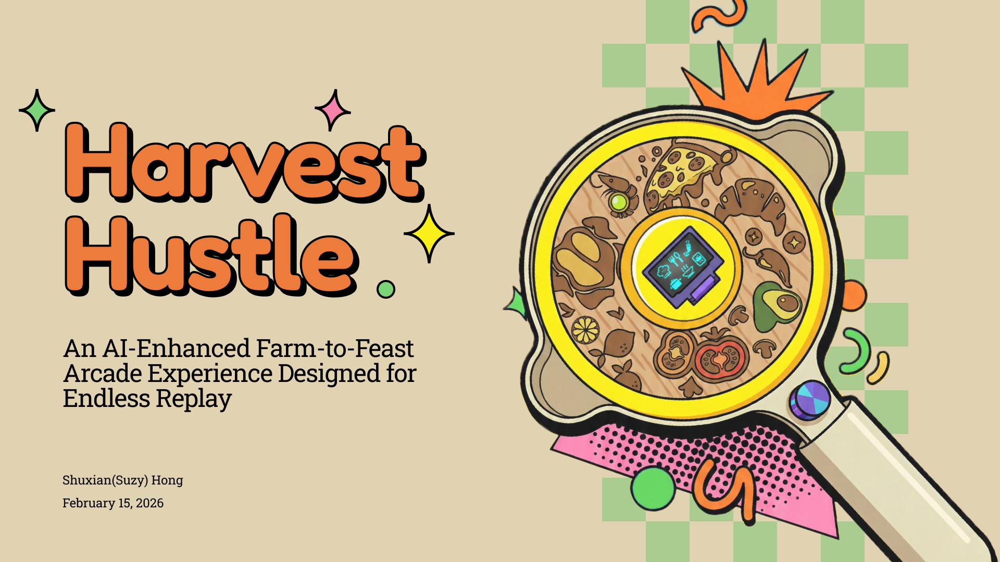

# **Harvest Hustle - "From Farm to Feast in 90 Seconds!"**
Created by Shuxian (Suzy) Hong — design, hardware, and software




## Game Overview
A 90s-era style handheld electronic game where players catch and collect raw cooking ingredients by chasing animals, picking crops, and harvesting resources. Some levels include special mechanics such as avoiding bees or sharks. The player’s goal is to finish each level before time runs out. Built using Xiao ESP32C3, SSD1306 OLED, ADXL345 accelerometer, rotary encoder, buzzer and NeoPixels.

---

## 🎮 Core Gameplay Loop
1. Player tilts or shakes the controller to collect ingredients.  
2. Ingredients appear and disappear based on timed events.  
3. Some levels include bees or sharks that require different behavior.  
4. If time runs out → Game Over.  
5. If required ingredients are collected → Win.

---

## 🎮 Game Live Demos
[Demo_Video1](https://drive.google.com/file/d/1DtzrfSNDH1ecTKdxknY37zZfyN-GQHuJ/view?usp=sharing)  
[Demo_Video2](https://drive.google.com/file/d/1N6D5tNH3Gf8nHJXWTMcbvPtAYlKs9KW5/view?usp=sharing)

---

## Difficulty Settings
Difficulty affects **time limit only**.

| Setting | Time Limit | Required Catches |
|---------|------------|-------------------|
| **Easy** | 90 seconds | Base amounts |
| **Medium** | 60 seconds | Base amounts |
| **Hard** | 45 seconds | Base amounts |

Select difficulty using the Rotary Encoder (clockwise only) on the mode selection screen.

---

## Input Controls

| Input | Hardware | Action | Notes |
|-------|----------|--------|-------|
| **Tilt Left** | Accelerometer | Move left | X direction |
| **Tilt Right** | Accelerometer | Move right | X- direction |
| **Tilt Forward** | Accelerometer | Move up (top-down) | Y- direction |
| **Tilt Backward** | Accelerometer | Move down (top-down) | Y+ direction |
| **Shake** | Accelerometer | Harvest/grab action | Total acceleration > 18g |
| **Rotate Encoder** | Rotary Encoder | Navigate menus / Collect rotate items | Clockwise only |
| **Press Button** | Encoder Button | Confirm selection / Cooking action | Manual debounce 50ms |

### Accelerometer Orientation
Standard orientation:
- X axis → **left/right**
- Y axis → **forward/backward**

---

## Collection Methods

| Method | How to Collect | Icon Indicator |
|--------|----------------|----------------|
| **Tilt** | Move player to touch falling/stationary items | Items fall or spawn on field |
| **Shake** | Stand near tree or plants and shake device | Wheat, fruit, tomato, herbs, etc. |
| **Catch** | Stay near animal for 0.6 seconds | Progress ring appears |
| **Rotate** | Approach item and rotate encoder 5 times | Dough, grapes→wine, potato→mashed potato |

---

## View Types

### Side View (Levels 1-2)
Classic platformer-style view. Player moves left and right only.  
The hen flies above and drops eggs, while the cow walks back and forth on the ground.

```
┌────────────────────────────┐
│ L1  45s            🥚1/2   │
│                            │
│   🐔              🐄       │
│         [👤]               │
│ ▓▓▓▓▓▓▓▓▓▓▓▓▓▓▓▓▓▓▓▓▓▓▓▓ │
└────────────────────────────┘
        LEFT ←──→ RIGHT
```

### Top-Down View (Levels 3-11)
Bird's-eye view. Player moves in all four directions.  
For example, chasing the chicken or pig to collect ingredients, or shaking the controller to pick vegetables like carrots.

```
┌────────────────────────────┐
│ L5  60s     🍗2/3  🐔1/3   │
│ ~~~~~~~~~~~~~ (waves) ~~~~ │
│     🐔                     │
│          [👤]      🐷      │
│                    🥕      │
└────────────────────────────┘
```

---

## 11 Levels Overview

### Levels 1-2: Brunch (Side View) 🍳

#### Level 1: Sunny Morning
- **Ingredients:** Egg ×2 (tilt), Milk ×2 (catch cows)
- **Animals:** Chicken (top), Cow (ground)
- **Dish:** Fried Egg + Milk

#### Level 2: Pancake Prep
- **Ingredients:** Egg ×2 (tilt), Wheat ×2 (shake)
- **Animals:** Chicken (top)
- **Dish:** Fluffy Pancakes

---

### Levels 3-4: Brunch (Top-Down) 🍳

#### Level 3: Full Breakfast
- **Ingredients:** Bacon ×2 (catch pigs), Egg ×2 (tilt), Tomato ×2 (shake)
- **Animals:** Pig (run), Chicken (run)
- **Dish:** Hearty Brunch

#### Level 4: Healthy Bowl
- **Ingredients:** Milk ×2 (catch cows), Berry ×2 (tilt), Honey ×2 (catch)
- **Animals:** Cow (run), Bee (run) ⚠️
- **Special:** Berries appear/disappear, Cooking phase (button)
- **Dish:** Berry Bliss Bowl
- **Warning:** Don't shake near the bee!

---

### Levels 5-8: Lunch (Top-Down) 🍗

#### Level 5: Poultry Chase
- **Ingredients:** Duck ×3 (catch), Chicken ×3 (catch)
- **Animals:** Duck (run fast), Chicken (run fast)
- **Dish:** Golden Roast

#### Level 6: Lakeside
- **Ingredients:** Fish ×3 (tilt), Lemon ×3 (shake trees)
- **Special:** Fruit trees
- **Dish:** Citrus Fish

#### Level 7: Hearty Stew
- **Ingredients:** Bacon ×3 (catch pigs), Carrot ×4 (shake), Potato ×4 (tilt)
- **Animals:** Pig (run)
- **Dish:** Cozy Stew

#### Level 8: Pizza Time
- **Ingredients:** Cheese ×3 (tilt), Tomato ×3 (shake), Dough ×2 (rotate)
- **Special:** Rotate encoder to knead dough, Cooking phase (button)
- **Dish:** Cheesy Pizza

---

### Levels 9-11: Dinner (Top-Down) 🦃

#### Level 9: Thanksgiving
- **Ingredients:** Turkey ×4 (catch), Cranberry ×5 (tilt), Potato ×3 (rotate)
- **Animals:** Turkey (run)
- **Special:** Cooking phase (button) for sauce
- **Dish:** Feast Turkey

#### Level 10: Ocean Bounty
- **Ingredients:** Fish ×4 (tilt), Shell ×5 (tilt), Seaweed ×5 (shake)
- **Animals:** Shark (danger) 🦈
- **Special:** Shark eats your collected fish!
- **Dish:** Grand Seafood Platter

#### Level 11: Gourmet (Final Level)
- **Ingredients:** Lamb ×4 (catch), Herbs ×5 (shake), Garlic ×4 (tilt), Grapes ×3 (rotate)
- **Animals:** Lamb (run)
- **Special:** Double cooking phase (button + rotate)
- **Dish:** Roasted Lamb

---

## Level Summary Table

| Level | View | Name | Ingredients | Special Features | Dish |
|-------|------|------|-------------|------------------|------|
| 1 | Side | Sunny Morning | Egg, Milk | Tutorial | Fried Egg + Milk |
| 2 | Side | Pancake Prep | Egg, Wheat | Shake to harvest | Fluffy Pancakes |
| 3 | Top-Down | Full Breakfast | Bacon, Egg, Tomato | 4-direction move | Hearty Brunch |
| 4 | Top-Down | Healthy Bowl | Milk, Berry, Honey | Bee penalty, Cooking | Berry Bliss Bowl |
| 5 | Top-Down | Poultry Chase | Duck, Chicken | Fast animals | Golden Roast |
| 6 | Top-Down | Lakeside | Fish, Lemon | Waves, Trees | Citrus Fish |
| 7 | Top-Down | Hearty Stew | Bacon, Carrot, Potato | Mixed methods | Cozy Stew |
| 8 | Top-Down | Pizza Time | Cheese, Tomato, Dough | Rotate + Cooking | Cheesy Pizza |
| 9 | Top-Down | Thanksgiving | Turkey, Cranberry, Potato | Fast turkey, Cooking | Feast Turkey |
| 10 | Top-Down | Ocean Bounty | Fish, Shell, Seaweed | Shark danger! | Grand Seafood Platter |
| 11 | Top-Down | Gourmet | Lamb, Herbs, Garlic, Grapes | Double cooking | Roasted Lamb |

---

## Game Flow

```
┌─────────────────┐
│  Title Screen   │  "HARVEST HUSTLE"
│  Press to Start │  "From Farm to Feast in 90 Seconds!"
└────────┬────────┘
         ▼
┌─────────────────┐
│  Select Mode    │  Rotate: EASY/MEDIUM/HARD
│  Press Confirm  │  (Clockwise cycles, wraps around)
└────────┬────────┘
         ▼
┌─────────────────┐
│  Select Level   │  Rotate: L1-L11
│  Press Confirm  │  (Shows 4 levels at a time)
└────────┬────────┘
         ▼
┌─────────────────┐
│  Level Intro    │  Shows ingredients needed
│  Press to Start │  (Multi-page for 4+ ingredients)
└────────┬────────┘
         ▼
┌─────────────────┐      Time runs out
│    Gameplay     │ ─────────────────────► Game Over
│  Collect items! │                        (Retry/Restart)
└────────┬────────┘                              │
         │ All collected                         │ Restart
         ▼                                       ▼
┌─────────────────┐                    ┌─────────────────┐
│ Cooking Phase   │                    │  High Score?    │
│ Hold Button!    │                    │  Enter Initials │
└────────┬────────┘                    └────────┬────────┘
         │                                      ▼
         ▼                             ┌─────────────────┐
┌─────────────────┐   Level 11         │  High Scores    │
│  Level Clear!   │ ───────────┐       │     Board       │
│  Shows dish!    │            │       └────────┬────────┘
└────────┬────────┘            │                │
         │                     ▼                ▼
         ▼              ┌─────────────────┐   Mode Select
    Next Level...       │  🎉 WIN! 🎉     │
                        │  MASTER CHEF!   │
                        └────────┬────────┘
                                 │
                                 ▼
                        ┌─────────────────┐
                        │  High Score?    │
                        │  Enter Initials │
                        └────────┬────────┘
                                 ▼
                        ┌─────────────────┐
                        │  High Scores    │
                        │     Board       │
                        └────────┬────────┘
                                 │
                                 ▼
                           Title Screen
```

---

## Game Over Screen

```
┌────────────────────────────┐
│        GAME OVER           │
│       Score: 350           │
│                            │
│   > Retry Level            │  ← Rotate to select
│     Restart Game           │
│                            │
└────────────────────────────┘
```

| Selection | Action |
|-----------|--------|
| **Retry Level** | Restart current level (forfeits level points) |
| **Restart Game** | Check high score, then return to mode selection |

---

## Cooking Phases

### Single Phase (Button)
Hold the encoder button to fill the progress bar.

```
┌────────────────────────────┐
│       Fermenting...        │
│                            │
│    [HOLD BUTTON]           │
│    [████████░░░░] 67%      │
│                            │
└────────────────────────────┘
```

### Double Phase (Button + Rotate)
First hold button, then rotate encoder.

```
Phase 1: Roasting...    → Hold Button to 100%
Phase 2: Making Wine... → Rotate Encoder to 100%
```

---

## Scoring System

Points are awarded based on the collection method:

| Collection Method | Points per Ingredient |
|-------------------|----------------------|
| **Tilt** | 10 pts |
| **Touch** | 20 pts |
| **Shake** | 30 pts |
| **Rotate** | 50 pts |

### Score Display
- **Level Clear Screen:** Shows points earned in that level (+XXX pts)
- **Game Over Screen:** Shows total score accumulated
- **Win Screen:** Shows final score for all 11 levels

### Score Rules
- Points are earned immediately when collecting ingredients
- **Retry Level:** Points from failed attempt are forfeited (subtracted)
- **Restart Game:** Total score resets to 0

---

## NeoPixel Feedback System

| LED Pattern | Meaning |
|-------------|---------|
| **Green Flash** | Ingredient collected successfully |
| **Red Flash** | Danger hit or penality |
| **Yellow Blink** | Selection feedback / Waiting state |
| **Rainbow Cycle** | Level complete! |
| **Purple Gradient** | Cooking phase progress |
| **All Off** | Idle / Game over |

---

## Special Mechanics

### Bee Penalty (Level 4)
- If you **shake** when a bee is nearby, it stings you — embarrassing for a chef!

### Shark Danger (Level 10)
- Shark moves around the field
- If shark touches you, you lose collected fish
- Visual warning with shark icon

### Berry Spawn (Level 4)
- Berries appear and disappear after 4 seconds
- Must collect quickly before they vanish

### Tree Shaking (Level 6)
- Trees spawn on the field
- Stand near tree and shake to drop fruit (lemon)
- Tree disappears after dropping fruit

### Rotate Collection (Levels 8, 9, 11)
- Certain items require rotating the encoder
- Approach item, then rotate 2-3 times (varies by level)
- Progress shown with rotation count

---

## Components Used

| Component | Pin | Purpose |
|-----------|-----|---------|
| **Xiao ESP32C3** | - | Main microcontroller |
| **SSD1306 128×64 OLED** | I2C (SCL/SDA) | Game display |
| **ADXL345 Accelerometer** | I2C (SCL/SDA) | Tilt and shake detection |
| **Rotary Encoder CLK** | D0 | Rotation detection |
| **Rotary Encoder DT** | D1 | Rotation direction |
| **Encoder Button** | D6 | Confirm/Action button |
| **NeoPixel LEDs (×8)** | D3 | Visual feedback |
| **Piezo Buzzer** | D2 | Audio feedback |

---

## Audio Feedback System

| Event | Sound | Description |
|-------|-------|-------------|
| **Power On** | Ascending 3-tone | Splash screen startup jingle |
| **Game Start** | C-E-G-C ascending | When starting a level |
| **Collect Item** | A5-C#6 quick beep | Successfully collecting an ingredient |
| **Menu Select** | Short click | Rotating through options |
| **Level Clear** | G-B-D ascending | Completing a level |
| **Game Over** | G-E-C descending | Time runs out |
| **Victory** | C-E-G-C + G-C fanfare | Beating all 11 levels |
| **Penalty** | Low 200-150Hz buzz | Wrong move or bee sting |

---

## Technical Parameters

| Parameter | Value | Notes |
|-----------|-------|-------|
| **Tilt Threshold** | 4.0 m/s² | Minimum tilt to register movement |
| **Shake Threshold** | 18.0 m/s² | Total acceleration to trigger shake |
| **Move Debounce** | 100ms | Delay between movement updates |
| **Touch Time** | 0.6 seconds | Time to stay near animal for touch collection |
| **Button Debounce** | 50ms | Prevents double-press |
| **Rotate Needed** | 5 (default) | Encoder rotations for rotate items |
| **High Score Count** | 3 | Number of high scores stored |
| **High Score Storage** | NVM | Uses microcontroller.nvm (15 bytes) |

---

## Screen Navigation

| Screen | Rotary Encoder | Button Press |
|--------|----------------|--------------|
| Title | - | Start game |
| Mode Select | Cycle: Easy → Medium → Hard → Easy | Confirm selection |
| Level Select | Cycle: L1 → L2 → ... → L11 → L1 | Confirm selection |
| Intro | - | Next page / Start level |
| Gameplay | Collect rotate items | - |
| Cooking | Rotate (phase 2) | Hold to cook (phase 1) |
| Clear | - | Next level |
| Game Over | Toggle: Retry ↔ Restart | Confirm selection |
| Win | - | Continue to high scores |
| Enter Initials | Cycle A-Z | Confirm letter |
| High Scores | - | Restart game |

---

## High Score System

The game tracks the top 3 scores with player initials, saved to the microcontroller's onboard NVM (non-volatile memory).

### How It Works

1. **After Game Over or Win:** The game checks if your score qualifies for the high score board
2. **New High Score:** If you achieved a high score, you enter your 3-letter initials
3. **Initials Entry:** Rotate encoder to cycle A-Z, press to confirm each letter
4. **High Score Board:** Shows top 3 scores with initials
5. **Persistent Storage:** Scores are saved to ESP32C3 NVM and survive power cycles

### High Score Screens

**Enter Initials Screen:**
```
┌────────────────────────────┐
│     NEW HIGH SCORE!        │
│       Score: 450           │
│                            │
│     Enter Initials:        │
│         A B _              │
│           ^                │
└────────────────────────────┘
```

**High Scores Board:**
```
┌────────────────────────────┐
│      HIGH SCORES           │
│                            │
│   1. ABC  1250             │
│   2. XYZ   890             │
│   3. QRS   450             │
│                            │
│     [Press Continue]       │
└────────────────────────────┘
```

---

## Future Enhancement Ideas

- [ ] Two-player competitive mode
- [ ] Seasonal level packs (Halloween, Christmas themes)
- [ ] Achievement badges displayed on win screen
- [ ] Endless mode after completing all 11 levels
